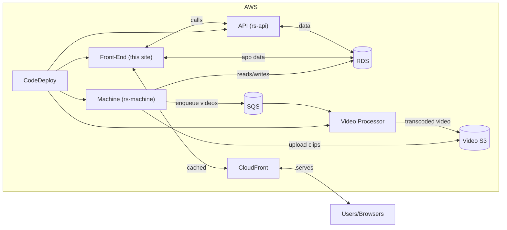

# Richmond Sunlight


This is the front-end of the website.  See also: [rs-machine](https://github.com/openva/rs-machine), the collection of scrapers and parsers that provide the site's third-party data, [rs-api](https://github.com/openva/rs-api), the API that powers (some of) the website, and [rs-video-processor](https://github.com/openva/rs-video-processor), the on-demand legislative-video-processing system.

## History

Richmond Sunlight started in 2005 as [a little RSS-based bill tracker](http://waldo.jaquith.org/bills/), updating every few hours. In 2006 it was built out as Richmond Sunlight, launching publicly in January of 2007. It's remained a hobby site ever since. The code base hasn’t been overhauled in all that time, and it shows — the site’s tech stack shows the growth rings of being developed over the course of many years. But it continues to function, and has been modernized in some ways, e.g. by adding a CI/CD pipeline, moving to SOA, etc.

## Branches

* [`master`](https://github.com/openva/richmondsunlight.com/tree/master): The [staging site](https://staging.richmondsunlight.com/).
* [`deploy`](https://github.com/openva/richmondsunlight.com/tree/deploy): The [production site](https://www.richmondsunlight.com/).

## Local development

The site can be run locally, in Docker:

1. [Install Docker](https://www.docker.com/products/docker-desktop).
1. Clone this repository. Make sure you’re using [the branch that you want](#branches).
1. Run `./docker-run.sh`.
1. In your browser, open `http://localhost:8000`.

Tests can be run with `./docker-tests.sh`. There are additional tests meant to be run locally, meant to build atop additional MariaDB data that isn't stored in GitHub (you've got to export it with `deploy/database_export.sh` from data harvested by Machine), which are invoked with `./docker-tests.sh --local`.

When you are done, run `./docker-stop.sh` (or quit Docker).

### Rebuilding the database

The database is initialized from SQL dumps when the MariaDB container is first created. If you change any SQL files under `deploy/mysql/`, those changes won't take effect until you destroy the existing database volume and rebuild:

```sh
docker compose down && docker volume rm richmondsunlightcom_db_data
./docker-run.sh
```

Removing the `db_data` volume forces MariaDB to re-run the init scripts on the next startup.

## Architecture


